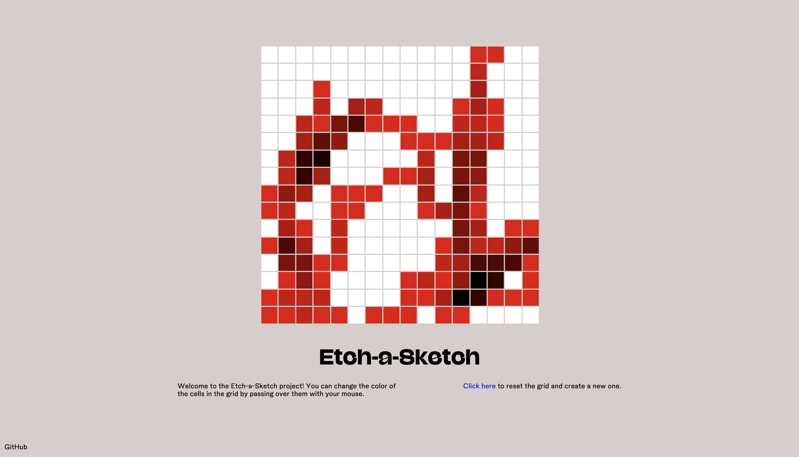

# Etch-a-Sketch

## Live Demo

[Visit the site](https://currytay.github.io/etch-a-sketch/)

**Note:** This website is best viewed on high res screens (1080p and up). Check the [improvements section](#improvements) for future updates.

## Project Details

### Prompt

From The Odin Project's [curriculum](https://www.theodinproject.com/courses/foundations/lessons/etch-a-sketch-project). 

### Built With

- JavaScript
- HTML5
- CSS3

## Improvements

Future features / opportunities for improvement:

- Make website responsive
